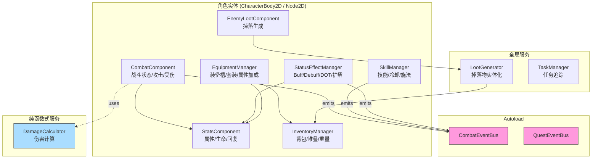
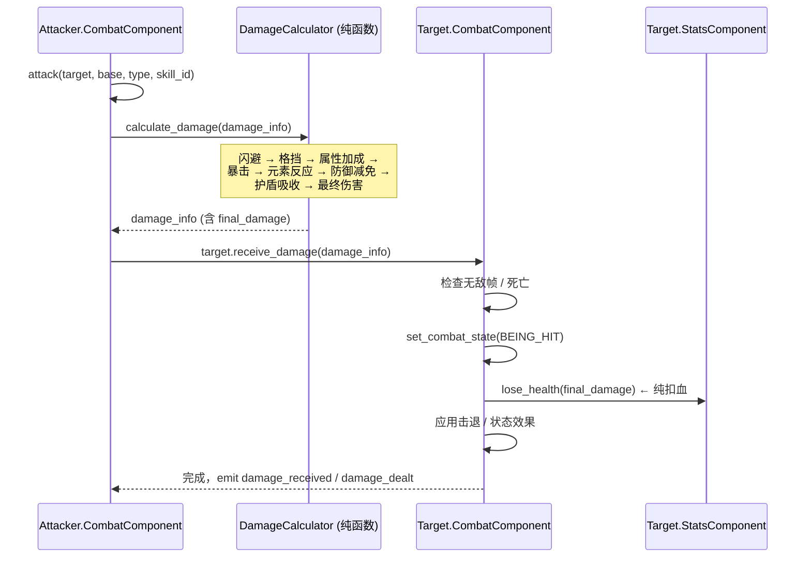

# Godot 4 · 2D ARPG 系统集合

> **一套面向 Godot 4 的、可复用的 2D ARPG 核心系统。**
> 战斗、属性、状态效果、技能、物品、装备、背包、掉落、任务 —— 全部以**组件化 / 数据驱动 / 纯 GDScript** 形态开源，配套完善的单元与回归测试。

<p align="center">
  
  
  <a href="https://github.com/ClarkWain/godot-arpg-kit/actions/workflows/tests.yml"></a>
  
  
</p>

---

## 一、这个项目是什么

一个**独立于任何具体玩法**的 Godot 4 · 2D ARPG 系统集合。目标是让你在开发自己的 ARPG / 类暗黑 / Rogue-like 项目时，可以**按需摘取**其中的某个系统（例如只用 Combat + Stats + Status Effects），或**成套使用**（战斗 + 装备 + 掉落 + 任务），而不必自己从零搭建这些底层轮子。

所有系统均遵循以下原则：

- **组件化**：`CombatComponent`、`StatsComponent`、`InventoryManager`、`StatusEffectManager` 等都是 `Node` 组件，直接挂到你的角色场景里即可。
- **数据驱动**：属性、物品、装备、技能、状态效果、掉落表全部是 `Resource`（`.tres`），可以在编辑器里可视化配置。
- **纯 GDScript**：不需要 Mono / C# / 第三方 addon，直接 `git clone` 后 F5 打开就能用。
- **事件总线解耦**：`CombatEventBus` / `QuestEventBus` 作为 autoload，各系统通过信号通信，避免硬耦合。
- **测试覆盖**：189 个单元与回归测试，覆盖 5 大模块（Combat / Items / Loot / Quest / Stats）的关键路径。

---

## 二、快速开始

### 1. 环境要求

- **Godot 4.5** 或更高（4.4+ 应当也可以，未做兼容性测试）
- Windows / Linux / macOS

### 2. 打开项目

```bash
git clone <this-repo> 2d_arpg
cd 2d_arpg
godot --editor
```

或者用 Godot 项目管理器 `Import` [project.godot](project.godot)。

### 3. 运行测试

**方式 A：一键脚本（推荐）**

```powershell
# Windows PowerShell
pwsh tools/run_tests.ps1

# 只跑某个模块
pwsh tools/run_tests.ps1 -Only combat
```

脚本会自动定位 Godot 可执行文件（可通过 `$env:GODOT` 覆盖），依次跑完 5 个模块共 189 个测试，按结果返回进程退出码。

**方式 B：直接调 Godot**

```bash
# 跑某个模块
godot --headless --path . 'res://tests/combat/combat_test_scene.tscn'
godot --headless --path . 'res://tests/items/item_system_test_scene.tscn'
godot --headless --path . 'res://tests/loot/loot_system_test_scene.tscn'
godot --headless --path . 'res://tests/quest/test_scene.tscn'
godot --headless --path . 'res://tests/stats/test_scene.tscn'
```

**方式 C：在编辑器里跑**

打开任一 test_scene，按 F6。

### 4. 集成到你自己的项目

见下方 [「使用示例」](#四使用示例) 章节，或者读一份**完整的分步教程**：[docs/getting_started.md](docs/getting_started.md) — 15 分钟从零到跑通「攻击 → 掉落 → 拾取」全链路。

> 想看**技术复盘**（这个项目怎么修 BUG、怎么治 flake、怎么调 CI）？读 [docs/tech-notes/godot-arpg-kit-postmortem.md](docs/tech-notes/godot-arpg-kit-postmortem.md)。

---

## 三、系统总览

### 架构一览



### 子系统清单

| 系统 | 主要脚本 | 核心职责 | 文档 |
|---|---|---|---|
| **Stats** 属性 | [stats_component.gd](scripts/stats/stats_component.gd) | 生命/魔力/耐力/护盾/属性修正/回复/升级 | [Stats属性系统使用文档.md](docs/Stats属性系统使用文档.md) |
| **Combat** 战斗 | [combat_component.gd](scripts/combat/combat_component.gd) · [damage_calculator.gd](scripts/combat/damage_calculator.gd) | 攻击/受伤/无敌帧/连击/死亡/伤害计算 | [Combat战斗系统使用文档.md](docs/Combat战斗系统使用文档.md) |
| **Status Effects** 状态效果 | [status_effect_manager.gd](scripts/combat/status_effects/status_effect_manager.gd) | Buff/Debuff/DOT/HOT/护盾/元素反应 | 见 Combat 文档 |
| **Skills** 技能 | [skill_manager.gd](scripts/combat/skills/skill_manager.gd) | 冷却/施法/装备槽/命中/资源消耗 | 见 Combat 文档 |
| **Items** 物品 | [item_data.gd](scripts/items/item_data.gd) · [item_instance.gd](scripts/items/item_instance.gd) | 物品定义（Resource）与运行时实例 | [Items物品系统使用文档.md](docs/Items物品系统使用文档.md) |
| **Inventory** 背包 | [inventory_manager.gd](scripts/inventory/inventory_manager.gd) | 格子/堆叠/重量/自动整理/事务化装备 | [Inventory背包系统使用文档.md](docs/Inventory背包系统使用文档.md) |
| **Equipment** 装备 | [equipment_manager.gd](scripts/equipment/equipment_manager.gd) | 装备槽/套装效果/耐久/属性加成 | [Equipment武器装备系统使用文档.md](docs/Equipment武器装备系统使用文档.md) |
| **Loot** 掉落 | [loot_generator.gd](scripts/loot/loot_generator.gd) · [loot_table.gd](scripts/loot/loot_table.gd) | 掉落表/概率/条件掉落/首杀奖励 | [Loot掉落系统使用文档.md](docs/Loot掉落系统使用文档.md) |
| **Quest** 任务 | [task_manager.gd](scripts/quest/task_manager.gd) | 任务定义/目标/条件/奖励/事件总线 | [Quest任务系统使用文档.md](docs/Quest任务系统使用文档.md) |

---

## 四、使用示例

### 场景 1：给角色接入战斗系统

```
Player (CharacterBody2D)
├─ StatsComponent          (base_stats: 你的 StatsData.tres)
├─ CombatComponent         (自动查找 StatsComponent)
├─ StatusEffectManager     (自动查找 StatsComponent)
├─ InventoryManager        (equipment_manager: ↓)
└─ EquipmentManager        (stats_component + inventory)
```

代码里挑一个敌人打：

```gdscript
# 玩家攻击敌人
var damage_info = $CombatComponent.attack(
    enemy_node,
    50.0,                                   # base_damage
    DamageInfo.DamageType.PHYSICAL,
    "sword_slash"                           # 可选 skill_id
)

# damage_info 包含最终伤害、暴击信息、闪避/格挡结果、元素反应等
print("造成伤害: ", damage_info.final_damage,
      " 暴击: ", damage_info.is_critical,
      " 反应: ", damage_info.elemental_reaction)
```

### 场景 2：喝药水回血

```gdscript
# 假设玩家背包里有一瓶红药水
var slot_index := 0
$InventoryManager.use_item(slot_index)   # target 默认为 InventoryManager 的父节点
# InventoryManager 会自动：
# 1. 定位 ConsumableData
# 2. 分派 INSTANT_HEAL / INSTANT_MANA / BUFF / DEBUFF_CURE 等效果
# 3. 应用到目标的 StatsComponent / StatusEffectManager
# 4. 消耗物品、发 item_used 信号
```

### 场景 3：敌人死亡时掉落物品

```
Enemy
├─ StatsComponent
├─ CombatComponent
└─ EnemyLootComponent  (main_loot_table: your_loot_table.tres)
```

`EnemyLootComponent` 会自动监听 `died` / `health_depleted` 信号，触发 `LootGenerator` 生成掉落物到场景中。

### 场景 4：订阅战斗事件（UI / 音效 / 成就）

```gdscript
# 因为 CombatEventBus 是 autoload，任何脚本都能直接访问：
func _ready():
    CombatEventBus.damage_dealt.connect(_on_any_damage)
    CombatEventBus.entity_killed.connect(_on_kill)

func _on_any_damage(source: Node, target: Node, info: DamageInfo):
    if info.is_critical:
        floating_text_manager.pop_crit_text(target.global_position, info.final_damage)
```

### 场景 5：接任务

```gdscript
# QuestEventBus 由业务代码（战斗/拾取/对话）负责 emit
CombatEventBus.entity_killed.connect(
    func(killer, victim):
        QuestEventBus.instance.enemy_killed.emit(
            victim.enemy_type_id, victim.instance_id, victim.level
        )
)
# TaskManager 会自动更新所有相关任务目标
```

---

## 五、伤害管线（重点）

伤害计算是 ARPG 系统里最容易出 BUG 的一块。本项目采用**攻击者侧 → 受击方侧**的单向流水线：



**关键设计原则**：`DamageCalculator` 已经算完所有减免，`receive_damage` **不再触发一次减伤链**，只做纯扣血 + 状态切换 + 信号派发。历史上曾经因为二次调用 `stats_component.take_damage()` 导致防御/闪避/护盾被结算两遍，参见 [伤害管线回归测试](tests/combat/test_damage_pipeline_regression.gd)。

`stats_component.take_damage()` 本身仍然对外开放，供 **DOT / 环境伤害 / 脚本直接扣血** 等"跳过 CombatComponent"的路径使用（此路径依然享有完整的减伤链）。

---

## 六、测试与 CI

### 测试套件（189 个）

| 套件 | 用例数 | 覆盖 |
|---|---:|---|
| **Combat** 套件 | | |
| · DamageCalculator | 9 | 属性加成、暴击、闪避、格挡、元素反应、护盾、护甲穿透、真实伤害 |
| · CombatComponent | 9 | 初始化、攻击、受伤、状态机、连击、无敌、死亡、治疗、信号 |
| · StatusEffectManager | 11 | 注册、叠加、DOT、HOT、Buff 属性、护盾、净化、元素追踪、序列化 |
| · SkillManager | 10 | 冷却、施法时间、施法距离、资源消耗、打断、序列化 |
| · 战斗系统集成 | 8 | 完整战斗流程、元素连招、Buff 增伤、DOT 击杀、护盾、装备加成、任务事件 |
| · **伤害管线回归**（新） | 6 | 双重减防 / 双重闪避 / 护盾单次消耗 / 端到端管线 / DOT 路径 / 死亡短路 |
| · **高优先级 BUG 回归**（新） | 13 | 消耗品、EventBus autoload、击退向量、装备事务、部分堆叠、元素 debuff |
| **Items** 套件 | 18 | ItemData / ItemInstance / EquipmentData / ConsumableData / WeaponData |
| **Loot** 套件 | 11 | LootEntry / LootTable 概率、条件判断、权重抽取 |
| **Quest** 套件 | 55 | TaskManager / TaskInstance / Objectives / Conditions / Rewards / 集成 |
| **Stats** 套件 | 39 | StatsData / StatModifier / LuckSystem / StatsComponent |
| **合计** | **189** | |

### 一键运行

```powershell
pwsh tools/run_tests.ps1
```

退出码 `0` = 全部通过，`1` = 有失败，`2` = 未找到 Godot。

### 预提交钩子

在项目根安装（推荐用符号链接以便脚本更新自动生效）：

```powershell
New-Item -ItemType SymbolicLink `
    -Path .git/hooks/pre-commit `
    -Target (Resolve-Path tools/pre-commit.ps1)
```

或复制方式：`Copy-Item tools/pre-commit.ps1 .git/hooks/pre-commit`。

跳过：`git commit --no-verify`。

### GitHub Actions

[.github/workflows/tests.yml](.github/workflows/tests.yml) 已配置好用 `barichello/godot-ci:4.5` headless 镜像，以 **matrix 方式并行** 跑 5 个模块（combat / items / loot / quest / stats）。推到 GitHub 后每次 push / pull_request 自动触发。

---

## 七、项目结构

```
├── project.godot                # 项目入口（含 autoload 段）
├── icon.svg
├── README.md                    # 你正在读的文件
│
├── docs/                        # 各子系统详细文档
│   ├── Combat战斗系统使用文档.md
│   ├── Equipment武器装备系统使用文档.md
│   ├── Inventory背包系统使用文档.md
│   ├── Items物品系统使用文档.md
│   ├── Loot掉落系统使用文档.md
│   ├── Quest任务系统使用文档.md
│   └── Stats属性系统使用文档.md
│
├── scripts/
│   ├── combat/                  # 战斗系统
│   │   ├── combat_component.gd
│   │   ├── combat_event_bus.gd  # ← autoload
│   │   ├── combat_state.gd
│   │   ├── damage_calculator.gd
│   │   ├── damage_info.gd
│   │   ├── skills/              # 技能子系统
│   │   └── status_effects/      # 状态效果子系统
│   ├── stats/                   # 属性系统
│   │   ├── stats_component.gd
│   │   ├── stats_data.gd
│   │   ├── stat_modifier.gd
│   │   └── luck_system.gd
│   ├── items/                   # 物品数据
│   │   ├── item_data.gd
│   │   ├── item_instance.gd
│   │   ├── consumable_data.gd
│   │   ├── equipment_data.gd
│   │   └── weapon_data.gd
│   ├── inventory/               # 背包
│   │   └── inventory_manager.gd
│   ├── equipment/               # 装备管理
│   │   └── equipment_manager.gd
│   ├── loot/                    # 掉落
│   │   ├── loot_generator.gd
│   │   ├── loot_table.gd
│   │   ├── loot_entry.gd
│   │   ├── dropped_item.gd
│   │   └── enemy_loot_component.gd
│   └── quest/                   # 任务
│       ├── task_manager.gd
│       ├── task_instance.gd
│       ├── task_data.gd
│       ├── task_state.gd
│       ├── quest_event_bus.gd   # ← autoload
│       ├── conditions/
│       ├── objectives/
│       ├── rewards/
│       ├── events/
│       └── core/
│
├── data/                        # 示例 .tres 资源
│   ├── player_base_stats.tres
│   └── items/
│
├── scene/                       # 示例场景
│   ├── inventory_example.tscn
│   ├── equipment_example.tscn
│   ├── item_test.tscn
│   ├── quest_system_example.tscn
│   ├── stats_regen_example.tscn
│   └── weapon_with_elemental_damage_example.tscn
│
├── tests/                       # 测试套件
│   ├── base/test_framework.gd   # 共用断言基类
│   ├── combat/                  # 6 个测试文件 + 场景
│   ├── stats/
│   ├── items/
│   ├── loot/
│   └── quest/
│
├── tools/                       # 本地 / CI 工具
│   ├── run_tests.ps1
│   └── pre-commit.ps1
│
└── .github/workflows/
    └── tests.yml                # GitHub Actions
```

---

## 八、开发指南

### 编码约定

- 使用 **GDScript**（避免 C# 依赖，方便直接 fork）。
- 类名 PascalCase（`InventoryManager`），文件名 snake_case（`inventory_manager.gd`）。
- 公共 API 加中文 `##` 文档注释。
- **导出属性**用 `@export`，**导出组**用 `@export_group("...")`。
- 组件都是 `Node` 或 `Resource`，避免依赖具体场景结构。

### 加一个新的子系统

以「添加对话系统」为例：

1. 建 `scripts/dialogue/`，写 `DialogueManager extends Node`。
2. 需要 autoload？在 [project.godot](project.godot) `[autoload]` 段加一行。
3. 用 `Resource` 定义数据（例如 `DialogueLine`）。
4. 想跨系统通信？加 signal 到 [combat_event_bus.gd](scripts/combat/combat_event_bus.gd) 或新建 `dialogue_event_bus.gd`。
5. 在 `tests/dialogue/` 加对应测试，继承 [tests/base/test_framework.gd](tests/base/test_framework.gd)。

### 写测试

```gdscript
# tests/dialogue/test_dialogue_manager.gd
extends TestFramework

func _init() -> void:
    super._init("DialogueManager测试")

func run_all_tests() -> void:
    test_start_dialogue()
    test_choose_option()
    print_report()

func test_start_dialogue() -> void:
    start_test("开始对话")
    var dm := DialogueManager.new()
    # ...
    var passed := assert_not_null(dm.current_line, "应有当前对话行")
    end_test(passed)
```

然后在你的 test runner 里 `preload().new()` 调 `run_all_tests()`。

### 提交前

- 跑 `tools/run_tests.ps1`，确认 exit 0。
- （可选）装 pre-commit 钩子自动化这个流程。

---

## 九、常见问答

**Q: 我只想用你的战斗系统，不想要背包 / 任务，怎么办？**
A: 直接把对应子目录（`scripts/combat/`、`scripts/stats/`、需要的 `scripts/items/`）拷进你的项目，把 [combat_event_bus.gd](scripts/combat/combat_event_bus.gd) 加到你的 project.godot `[autoload]`，就可以用了。测试也可以选择性拷贝。

**Q: 支持多人 / 网络同步吗？**
A: 目前是单机设计。信号总线是 autoload，本身可以桥接到 `MultiplayerAPI`；但**内部状态（如伤害计算、状态效果）不做网络同步**。要做联机需自行加同步层。

**Q: 支持 3D 吗？**
A: 战斗 / 属性 / 状态 / 装备 / 背包 / 任务 都不依赖 2D，可以直接用于 3D。只有 [scripts/loot/loot_generator.gd](scripts/loot/loot_generator.gd) 里用了 `Vector2` 散开逻辑，需要小改成 `Vector3`。

**Q: 如何添加新的伤害类型（例如「腐蚀」）？**
A: 在 [damage_info.gd](scripts/combat/damage_info.gd) `DamageType` 枚举末尾追加 `CORROSION`，然后在 [damage_calculator.gd](scripts/combat/damage_calculator.gd) 的 `_apply_attribute_modifiers` / `_check_elemental_reaction` 里加分支即可。资源文件不受影响。

**Q: 元素反应表在哪？如何自定义？**
A: [damage_calculator.gd](scripts/combat/damage_calculator.gd) `_check_elemental_reaction()`。目前内置：蒸发（火+冰 ×2.0）、融化（冰+火 ×1.5）、感电（雷+水 ×1.2 + shocked）、超载（火+雷 ×1.5 + burning）、超导（冰+雷 ×1.3 + frozen）。附加的 debuff 由 [combat_event_bus.gd](scripts/combat/combat_event_bus.gd) `_register_default_reaction_effects()` 提供默认实现，你也可以在自己的启动脚本里先 `StatusEffectManager.register_effect(...)` 覆盖它们。

**Q: 如何禁用 `equip_item` 事务化？**
A: 只要不给 `InventoryManager.equipment_manager` 赋值就行——`equip_item` 会退回到旧的「仅 remove_item」行为，并 push_warning 提醒。

---

## 十、贡献

欢迎 PR。提交前请：

1. 跑 `tools/run_tests.ps1`，保证 exit 0。
2. 为新功能加测试，测试用例数增加。
3. 若引入公共 API 变更，同步更新 [docs/](docs/) 中对应文档。
4. commit message 用 [Conventional Commits](https://www.conventionalcommits.org/) 风格（`feat:` / `fix:` / `test:` / `docs:` / `ci:`）。

---

## 十一、License

MIT — 见 [LICENSE](LICENSE)（若无 LICENSE 文件，视作 MIT 授权）。

在你自己的项目里使用、修改、分发均无需通知作者，但保留原始版权声明即可。
